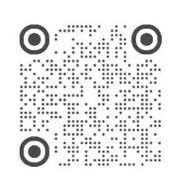

# -3- Deokki~ ♡

### *a tiny SANdeoki living on your desktop.*

摸摸头、戳戳脸颊、挠挠身体……  

Deokki 会给你不同的反应 ♡  

**本次共设计了 8 种互动，欢迎慢慢解锁～**

---

## 💻 下载 -3- Deokki

**当前版本：v1.2.1**

### 适用于Windows系统，点击下方链接下载最新版：

### 👉 [-3- Deokki ♡](https://github.com/Behonest1117/Deokki-desktop-pet/releases/latest)

下载完成后，双击 `Deokki-Setup-v1.2.1.exe`，按照提示完成安装即可 ♡

> 💡 第一次安装或运行时，如果 Windows 弹出安全提示，请确认文件来自本仓库后再继续。

---

## 🐱 关于 -3- Deokki

-3- Deokki 是一只住在电脑桌面上的电子宠物

平时它会乖乖待在你的桌面上。 

当你和它互动，例如摸摸头、戳戳脸颊、挠挠身体…… Deokki 会给你不同的反应。

希望梯尼在工作、学习的时候，这只小小的 Deokki 会一直陪着你 ♡

---

## ✨ 互动预览

不同的互动方式，会触发 Deokki 不同的小动作和反应。

一共 **8 种互动**，就留各位梯尼慢慢发现 ♡

---

## 💌 开发者自述

哈喽大家好，我是 **Be.honest.** ♡

做这个 app，是想让喜欢伞尼的朋友们在工作/学习时，也会有一只小小的 Deokki 一直待在桌面陪着你。

-**-3-** 来自崔伞很喜欢用的嘟嘴小表情，表示“亲亲”；  
-**Deokki** 则来自 SANdeoki。

于是，就有了这只小小的像素猫猫 **-3- Deokki~ ♡**

我会继续更新和维护 app，也欢迎告诉我你想让 Deokki 学会的新东西～

---

## 💜 小红书｜How to Find Me

**Be.honest.**

**小红书 App 扫码，可以找到我**

欢迎持续关注，也非常希望你能告诉我使用反馈、遇到的 bug，  

以及你想让 Deokki 学会的新东西 ♡

### Have fun with -3- Deokki ♡

---

本项目为非商业粉丝自制作品，并非官方产品，与艺人及所属公司无官方关联。
